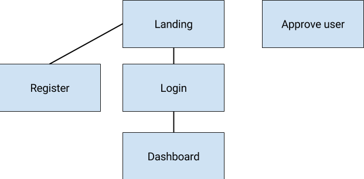

# Car Rental System

## Project information

This project consists in building a web car rental system, where users can upload new clients and
rent to their cars. The system manages three types of entities: Users, Clients and Cars. For the users
the system knows about, their email, their password, which should be stored securely in the database
and their full name.
For the clients, the systems stores their name, the driver license id and a telephone.
For the cars, the system stores their model, the year, the number of km and  it's status (which
can be either *rented* or *available*). In case that a car is rented, is important to store which client
rent the car, which user makes the rent, the rent's dates and the devolution's date.

### Registration and approval

Users have to request to register to the site. Upon request, a system administrator has to approve
their request for them to use the site.

### Dashboard and rent management

When the user logs in they are redirected to their Dashboard, which shows a list of rents makes by that
user. The rent's with devolution date previous current date should be marked.
In the dashboard the user can also add a new client, rent a car to a client (the car shouldn't be rented) and
return a rent. When a rent is returned it must disappear of the list.
The dashboard will allow showing all tickets including closed ones.

## Pages

We propose a site structure the picture below, having a separate site for using the rent system, and
another special page for administrators for the purpose of approving users.

You can adapt the schema, as long as the site provides following pages:

- Register Page, where users can register. They have to wait until an administrator authorizes them
  to enter again.
- Login page to enter the Dashboard
- Dashboard page containing a rent list and
  - Filters: by car and client
  - Sort: by devolution date
  - Individual actions: Make a new rent, retunr a rent
- Make a rent page, where the user can enter the following information
  - Car, client, and devolution dates editable.
  - The systems should suggest only *available* cars
  - Creation date is read only and set to the browser date.
  - Rent's User is read only and is set to the logged in user.
- Create client page, where the user can create new clients
- Client details page, where the user can see/edit the client information. I will be very useful if you
  can show a list with the rented car by these client.

### Hints

- If you use Django, you can use the built in [Admin site](https://docs.djangoproject.com/en/2.0/ref/contrib/admin/)
  page for implementing this in another framework consider using an Admin Site for this instead of crafting
  a page specifically for this.

- The landing page can have a log in form included instead of a dedicated login page.
