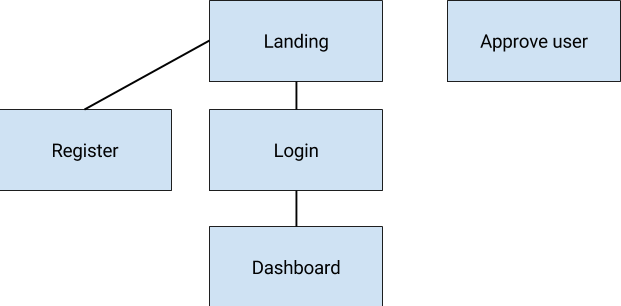

# Stock System

## Project Information

This project consists of building a web stock system where users can upload new products and administer
their stock. The system manages two types of entities: Users, Products. For the users, the system knows:
their email, their password (which should be stored securely in the database), and their full name.
For the products: product name, category (a predefined list), prices, creation date and stock quantity.

### Registration and Approval

Users have to submit a request to register with the site. A system administrator then has to approve
their registration request for them to be able to use the site.

### Dashboard and Product Management

When the user logs in they are redirected to their Dashboard, which shows a list of products.
The products with stock lower than a configurable value should be marked.
In the dashboard, the user can also add a new product.

## Pages

We propose a site structure like the picture below, creating a separate site for using the stock system
and another special page for administrators for the purpose of approving users.

You can adapt the schema, as long as the site provides the following pages:

- Registration Page where users can register. (They have to wait until an administrator authorizes them
  to enter again.)
- Login page to enter the Dashboard
- Dashboard page containing a product list and the following features:
  - Filters: by category
  - Sort: by name, by stock quantity
  - Individual actions: create a new product, edit a product
- Create a product with the following characteristics:
  - User can edit the product category, product name, and stock quantity.
  - The system should suggest the categories from a combobox, for example.
  - Creation date is read only and set to the browser date.
  - User is read only and is set to the logged in user.
  - Stock can't be lower than 0
- Edit/Detail product:
  - Name is not editable

### Hints

- If you use Django, you can use the built in [Admin Site](https://docs.djangoproject.com/en/2.0/ref/contrib/admin/)
  page for implementing this. If you use another framework, consider using a different Admin Site
  instead of crafting a page specifically for this.

- You can include a log in form on the landing page rather than creating a dedicated login page.
