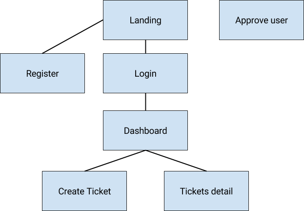

# Ticketing System

This project consists of building a web-based ticketing system, where users can upload tickets and distribute
tasks among project teammates. The system manages two types of entities: Users and Tickets. For the users
the system knows the following information: their email, their password (which should be stored securely
in the database), and their full name. For the tickets: the ticket title, the description, its status
(which can be either *open* or *closed*), and the creation date. Also, for each ticket the system stores:
the Author and the Assignee (both of whom are User entities).

## Registration and Approval

Users have to submit a request to register with the site. A system administrator then has to approve
their registration request for them to use the site.

## Dashboard and Ticket Management

When the user logs in, they are redirected to their Dashboard which shows a list of tickets assigned
to that user. Tickets can be created, edited, closed or assigned to another user. If the ticket is closed,
it will no longer appear in the dashboard by default. If the ticket is assigned, it will appear only
to the assigned user. The dashboard must allow for displaying all tickets, including closed ones.

## Pages

We propose a site structure made up of a separate site for using the Ticket system, and
another special page for administrators for the purpose of approving users.

You can adapt the schema, as long as the site provides following pages:

- Registration Page, where users can register. (They will have to wait until an administrator authorizes
 their account to enter again.)
- Login page to enter the Dashboard
- Dashboard page containing a ticket list and the following features:
  - Filters: by title and status
  - Individual actions: Create a ticket, edit a ticket, and delete a ticket
- Ticket creation page with the following features and characteristics:
  - User can edit the title, body, status and assignee.
  - Status is open by default.
  - Creation date is read only and set to the browser date.
  - Author is read only and is set to the logged in user.
  - Assignee is the logged in user by default but you can change it by selecting from a list of users.
- Ticket details page, where the user can see and edit the ticket status, body and title.

### Hints

- If you use Django, you can use the built in [Admin Site](https://docs.djangoproject.com/en/2.0/ref/contrib/admin/)
  page. For implementing this in another framework, consider using an Admin Site instead of crafting
  a page specifically for this.

- You can include a log in form on the landing page rather than creating a dedicated login page.
